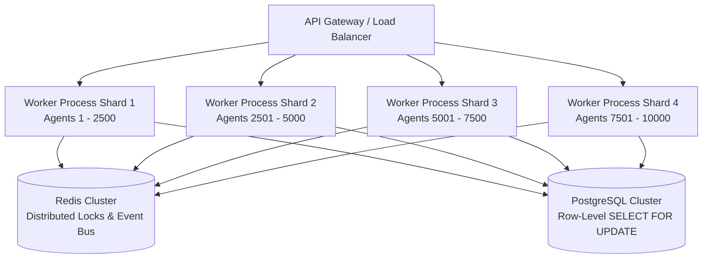

# Architectural Decision Record (ADR) - SmartDialer Predictive Mode

## ADR 001: Technology Stack & Single-Process Concurrency Architecture

### Status
Accepted

### Context
An outbound collections call center requires an automated SmartDialer operating in Predictive Mode. The system must maintain high agent utilization while strictly capping abandon rates below compliance thresholds (3.0%). High-concurrency call allocation requires preventing race conditions where multiple worker threads/tasks reserve the same agent or over-allocate calls beyond agent availability.

### Decision
For the initial prototype, we select:
1. **Python (FastAPI)** for backend API endpoints and async execution.
2. **SQLite (WAL Mode)** for zero-infrastructure persistence.
3. **In-Memory `asyncio.Lock` + Optimistic Locking (`version` column)** for single-process concurrency safety.

### Justification & Trade-Offs

#### 1. Why SQLite for a Single-Process Prototype?
SQLite in Write-Ahead Logging (WAL) mode allows concurrent async reads alongside a single writer. For a single-process prototype, SQLite requires zero setup, zero network RPC overhead, and provides atomic transactions with full ACID compliance.

#### 2. Why In-Memory `asyncio.Lock` + Optimistic Versioning?
- **Per-Agent `asyncio.Lock`**: Enforces strict mutual exclusion in memory before hitting SQLite, preventing database write collisions across concurrent async tasks within the process.
- **Optimistic Locking (`version` column)**: Acts as a secondary safety guard. Every agent state change requires `WHERE version = expected_version`, preventing stale updates.

#### 3. What This Makes Easier
- Simple deployment and debugging without external Docker containers or services.
- Zero network latency for state lock acquisition.
- Fully reproducible end-to-end failure simulations.

#### 4. What This Makes Harder
- **Single Process Bottleneck**: Cannot scale horizontally across multiple application servers.
- **SQLite Write Lock Contention**: SQLite supports only one concurrent write transaction at a time. High write throughput (>500 writes/sec) introduces SQLite busy lock errors.
- **In-Memory Lock Scope**: `asyncio.Lock` is process-local and invisible to other worker processes.

### Scaling Architecture (1,000 → 10,000 Agents)

#### Bottleneck Identification
At 1,000 to 10,000 agents:
1. **Global asyncio event loop CPU saturation**: Handling 10,000 active state transitions, call heartbeats, and provider webhooks on a single thread event loop causes event loop lag and delayed pacing ticks.
2. **SQLite Write Lock Contention**: Multi-threaded or multi-process access to SQLite hits `SQLITE_BUSY` errors due to database-level write locks.

#### Scale Fix: Sharding + Postgres Row Locks + Redis Distributed Locks
Do **NOT** simply "add more stateless web servers". State machines require strict lock isolation.

1. **Agent Sharding**: Partition agents deterministically across worker shards using agent ID hashing (`hash(agent_id) % num_shards`). Each worker process owns pacing and allocation for its assigned shard.
2. **PostgreSQL Row-Level Locking**: Replace SQLite with PostgreSQL using `SELECT ... FOR UPDATE SKIP LOCKED` for lock-free agent reservation queues.
3. **Redis Distributed Locks & State Cache**: Use Redis Redlock / lua scripts for cross-process agent reservation locks and real-time state telemetry.

---

## ADR 002: Post-Testing Architectural Corrections (Aug 21)

### Status
Accepted

### Context
Manual verification and fresh-clone testing surfaced three real gaps between the intended predictive-mode design and the actual implementation. Each was found through direct testing (not code review) and fixed the same day.

### Decision & Findings

#### 1. Predictive allocator was structurally behaving as progressive
The original `CallAllocator` pre-reserved one agent per dialed call *before* dialing, which capped real execution at strict 1:1 regardless of what the Safety Controller approved. This meant the system could never produce a true "connected call, no agent free" abandonment -- the exact failure mode the assignment centers on ("What happens when more borrowers answer than we have agents available to handle?").

**Fix:** Decoupled dialing from agent reservation. Predictive calls now dial without a pre-reserved agent; an agent is reserved only if/when the borrower actually answers. If no agent is free at that moment, the call transitions to a new terminal state, `ABANDONED` -- distinct from `FAILED` (no answer). Progressive mode is untouched and still reserves the agent before dialing, preserving its deterministic 1:1 safety guarantee.

#### 2. Safety Controller had no provider-health signal
The Safety Controller originally reacted only to abandon rate (borrower-side risk). A 100% provider outage produced a 0% abandon rate, because calls failed at dial-time before any borrower could be abandoned -- so the system never detected the outage on its own, despite "provider health" being an explicit input the assignment lists.

**Fix:** Added a second, independent `rolling_failure_rate` signal tracking true technical/provider failures, with its own threshold and its own path to `FALLBACK_PROGRESSIVE`, separate from the abandon-rate check.

#### 3. No-answer outcomes were conflated with technical failures
After adding the failure-rate signal, low-answer-rate scenarios (e.g. 20% answer rate, meaning 80% "no answer" by design) immediately breached the failure-rate threshold and triggered `FALLBACK_PROGRESSIVE` against a perfectly healthy provider -- a false positive caused by treating "no answer" and "technical failure" as the same `FAILED` state.

**Fix:** Simulated no-answer outcomes are now tagged distinctly (a `NO_ANSWER:` prefix on the call's `error_message`), so only genuine technical/provider errors count toward the failure-rate metric. Ordinary no-answers are excluded from provider-health calculations while still counting toward the answer-rate calculation.

### Verification
All three fixes were validated by: rerunning the full pytest suite (11/11 passing), rerunning all five failure simulations, rerunning the A/B/C/D scenario suite (confirming distinct, answer-rate-proportional pacing behavior across scenarios, and confirming `sim_provider_outage.py` still correctly triggers fallback on a genuinely broken provider), and a full fresh-clone-and-reinstall verification to confirm the fixes are correctly committed and reproducible.

### Known Remaining Limitation
The simulator resolves an answered call's full lifecycle (ANSWERED → CONNECTED → COMPLETED) synchronously within a single tick, so per-tick agent utilization reads near 0% even under heavy predictive load -- agents cycle back to `AVAILABLE` before the next metrics snapshot captures them as busy. A more realistic simulation would hold agents in `CONNECTED` for a sampled talk-duration and free them only on a later tick. Given the assignment's timebox, this was documented as a known simplification rather than fixed; it does not affect the correctness of the state machines, safety logic, or predictive-dialing behavior described above.
