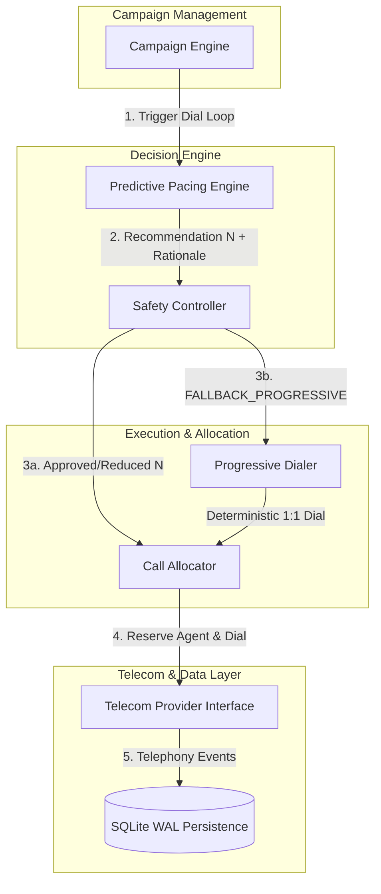
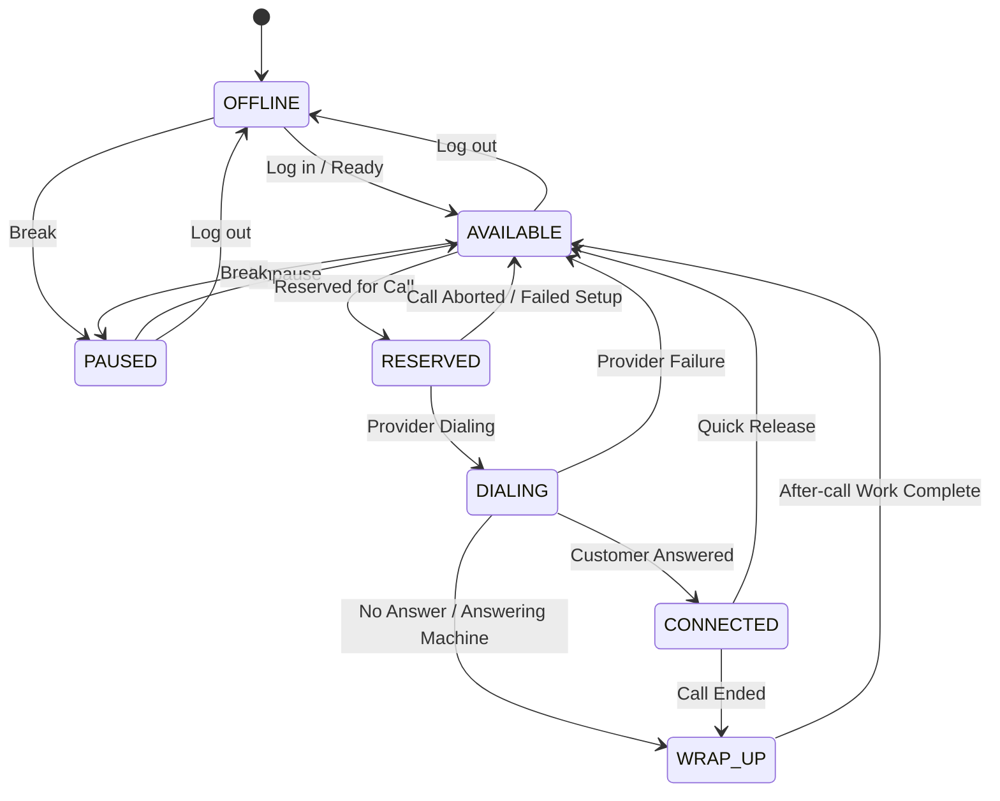
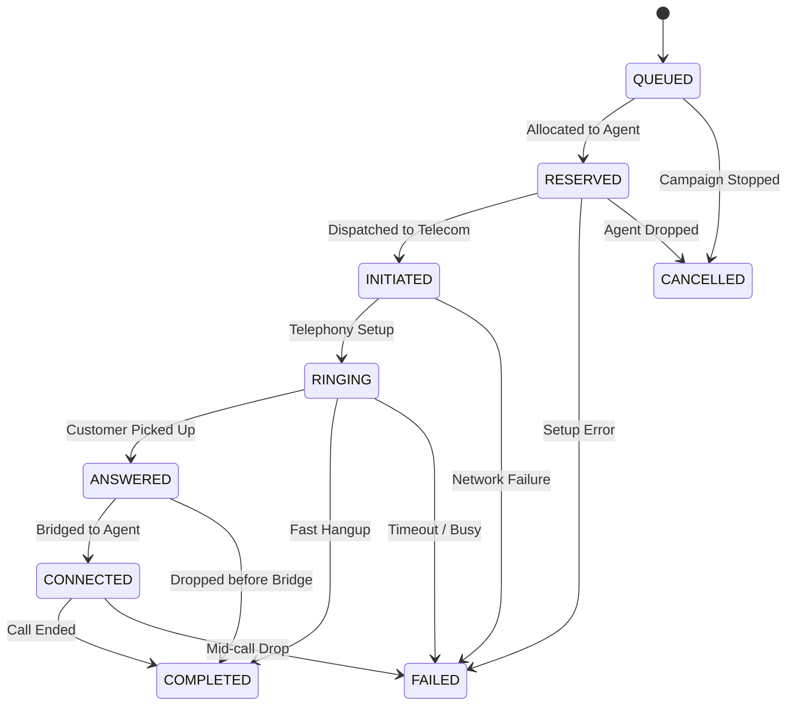

# SmartDialer System Architecture

SmartDialer is an outbound collections dialing system built with Python, FastAPI, SQLite, and `asyncio`. It is designed with strict pipeline layering to guarantee concurrency safety, operational compliance, and decision explainability.

## High-Level Architecture Pipeline

## Core Components

1. **Campaign Engine (`app/campaign/`)**: Coordinates campaign execution loop, triggering pacing evaluation and dispatch.
2. **Predictive Pacing Engine (`app/pacing/`)**: Computes optimal call launch volume $N$ based on rolling answer rate, setup times, and agent state velocity. Zero dependencies on Telecom or Allocator.
3. **Safety Controller (`app/safety/`)**: Independent compliance layer capping call rates based on hard limits and historical abandon rate. Triggers Progressive Fallback when safety thresholds are breached.
4. **Progressive Dialer (`app/progressive/`)**: Dedicated module providing deterministic 1:1 agent-to-borrower call allocation, handling agent dropouts, failure retries, and concurrency limits.
5. **Call Allocator (`app/allocator/`)**: Executes approved predictive call batches by reserving available agents and interfacing with Telecom Providers.
6. **Telecom Provider Interface (`app/providers/`)**: Abstract driver enabling pluggable providers (`ProviderA` fast/reliable vs `ProviderB` slow/flaky).

## State Diagrams

### Agent State Machine

### Call State Machine

