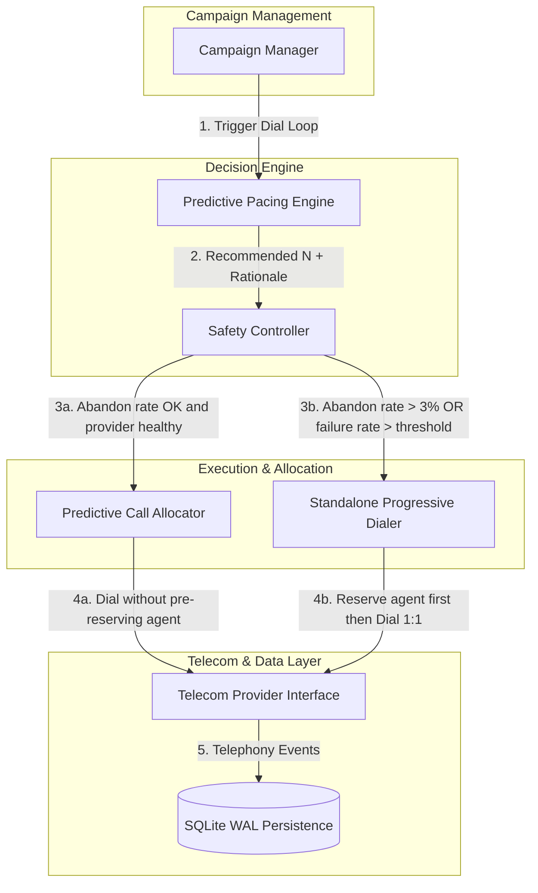
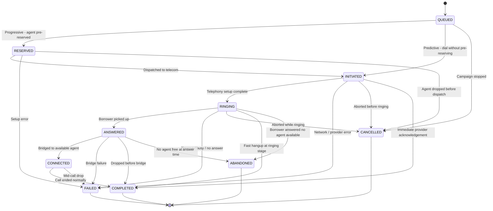
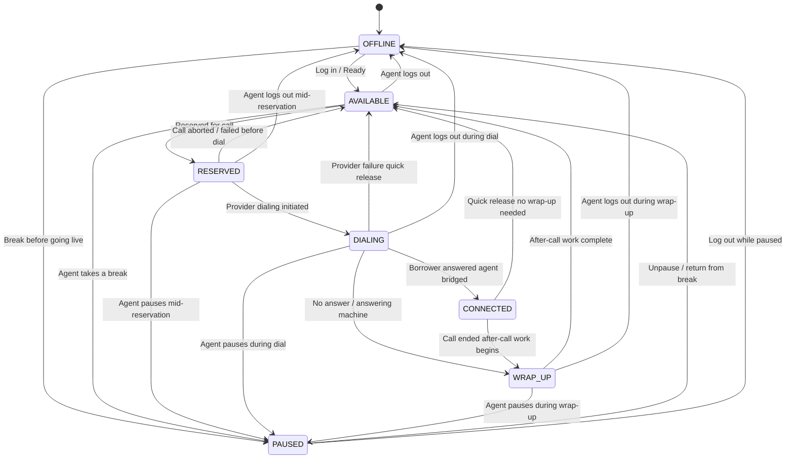

# SmartDialer System Architecture

SmartDialer is an outbound collections dialing system built with Python, FastAPI, SQLite, and `asyncio`. It is designed with strict pipeline layering to guarantee concurrency safety, operational compliance, and decision explainability.

## High-Level Architecture Pipeline

**Key pipeline invariants:**
- The Predictive Call Allocator dials calls **without pre-reserving an agent**. Agent reservation is attempted only after a borrower answers. If no agent is free at that moment, the call transitions to `ABANDONED` — a true compliance-relevant terminal state, distinct from `FAILED` (no answer / provider error).
- The Standalone Progressive Dialer retains the original guarantee: it marks an agent `RESERVED` *before* initiating the telephony request, enforcing strict 1:1 allocation.
- The Safety Controller evaluates **two independent signals**: `rolling_abandon_rate` (borrower-side risk) and `rolling_failure_rate` (provider/technical health). Either alone can trigger `FALLBACK_PROGRESSIVE`.

---

## Core Components

| Component | Module | Responsibility |
|---|---|---|
| **Campaign Manager** | `app/campaign/` | Drives the per-campaign execution loop; triggers pacing evaluation and dispatch each tick. |
| **Predictive Pacing Engine** | `app/pacing/` | Computes optimal call-launch volume *N* from rolling answer rate, setup times, and agent state velocity. Zero dependencies on Telecom or Allocator. |
| **Safety Controller** | `app/safety/` | Independent compliance gatekeeper. Evaluates abandon rate and provider failure rate; caps or redirects calls to Progressive mode when thresholds are breached. |
| **Predictive Call Allocator** | `app/allocator/` | Executes approved predictive batches. Dials without pre-reserving an agent; reserves an agent only after a borrower answers. |
| **Standalone Progressive Dialer** | `app/progressive/` | Deterministic 1:1 allocator. Reserves the agent before dialing; handles agent dropouts, failure retries, and concurrency limits. |
| **Telecom Provider Interface** | `app/providers/` | Abstract driver enabling pluggable providers (`ProviderA` fast/reliable vs `ProviderB` slow/flaky with duplicate/out-of-order events). |
| **Reconciliation Engine** | `app/reconciliation/` | Background task that detects half-committed calls/agents (e.g. after a worker crash) and releases orphaned resources. |

---

## State Diagrams

### Call State Machine

States are defined in `app/state_machines/call_state.py`.

**Terminal states**: `COMPLETED`, `FAILED`, `CANCELLED`, `ABANDONED`

**Note on `ABANDONED`**: This is a compliance-relevant terminal state meaning the borrower answered but no agent was available to take the call. It is **distinct from `FAILED`** (which means the borrower never answered, or a technical failure occurred). Only predictive calls can reach `ABANDONED`; progressive calls never can, because agents are pre-reserved before dialing.

---

### Agent State Machine

States are defined in `app/state_machines/agent_state.py`.

---

## Concurrency Safety

All state transitions are protected by two independent guards:

1. **Per-entity `asyncio.Lock`** (`AgentLockRegistry`, `CallLockRegistry`): Enforces strict mutual exclusion in memory before any SQLite write, preventing race conditions across concurrent async tasks within the single process.
2. **Optimistic Locking (`version` column)**: Every `UPDATE` requires `WHERE id = ? AND version = ?`. A `rowcount != 1` result means a concurrent writer won the race; the failing task raises `OptimisticLockError` rather than silently applying a stale update.

This dual-guard pattern makes state machine transitions atomic and idempotent against duplicate events, out-of-order events, and worker task crashes.

---

## Persistence

SQLite in **Write-Ahead Logging (WAL)** mode provides:
- Concurrent async reads alongside a single writer (suitable for single-process prototype workloads)
- Full ACID transactions with zero infrastructure overhead
- Simple deployment and fully reproducible failure simulations

See [ADR.md](ADR.md) for the detailed technology stack rationale and the scaling path to PostgreSQL + Redis at 1,000-10,000 agents.
