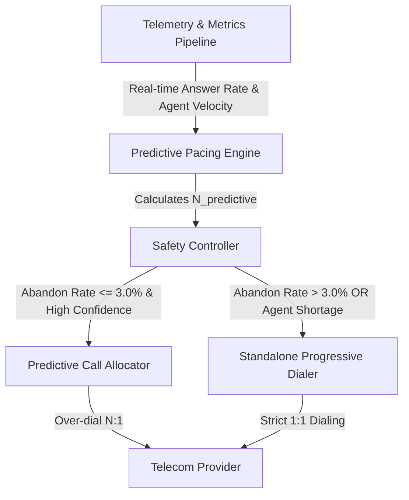

# SmartDialer Design Summary

## Question
**"How would you build a SmartDialer that gets as much utilization benefit of predictive dialing as possible while retaining the deterministic safety of progressive dialing?"**

---

## Technical Answer

To maximize agent utilization via predictive dialing while retaining the strict, zero-abandon safety of progressive dialing, the system must implement a **Hybrid Dual-Engine Architecture with Dynamic Circuit-Breaker Fallback**.

### 1. Dual Pacing Modes with Deterministic Circuit Breaker
- **Normal Operating Envelope (Predictive Mode)**: The Predictive Pacing Engine computes expected agent free rates based on rolling setup times ($T_{setup}$), talk times ($T_{talk}$), and windowed answer rates ($P_{ans}$). It over-dials calls to fill anticipated agent availability.
- **Safety Gatekeeper (Safety Controller)**: Sits downstream of the pacing engine. If the rolling abandon rate breaches compliance limits ($>3.0\%$) or available agent buffer collapses below safety thresholds, the controller immediately forces a deterministic fallback to the **Standalone Progressive Dialer**.

### 2. Standalone Progressive Guardrail
- The Progressive Dialer operates on strict $1:1$ logic ($1 \text{ available agent} \rightarrow 1 \text{ call attempt}$).
- **Pre-Dial Agent Locks**: Marks agents `RESERVED` before initiating telephony requests.
- **Pre-Dispatch Verification**: Re-verifies agent state in database millisecond prior to call setup. If an agent pauses, logs off, or disappears mid-setup, the attempt is aborted instantly, preventing orphaned ringing calls.
- **Automatic Failure Recovery**: If a progressive call fails or times out, the agent is released back to `AVAILABLE`, and the borrower retry policy is enforced.

### 3. Dynamic Buffer Allocation & Quantile Confidence Windows
- Rather than static multipliers, the predictive engine scales over-dialing using confidence intervals. When historical answer rate variance is low, over-dialing is expanded to maximize utilization. When variance spikes or call setup time increases, the safety controller shrinks the over-dialing window toward $1:1$ progressive allocation.

### 4. What Testing Revealed (and How the Design Responded)

The description above is the intended design -- but building the dual-engine architecture correctly required finding and closing gaps between intent and implementation, discovered through direct testing rather than code review:

- **A naive predictive allocator can silently degrade into progressive behavior.** If agent reservation isn't deliberately decoupled from dialing, the allocator ends up unable to ever dial more calls than there are agents -- defeating the entire purpose of predictive mode, even while the Safety Controller believes it approved a genuine over-dial. The fix was to let dialing proceed independent of agent availability, and resolve the agent question only at the moment of actual answer, with a true `ABANDONED` outcome -- not a silently enforced cap -- when no agent is free.
- **Abandon rate alone is an incomplete safety signal.** A borrower-side metric (answered, no agent) says nothing about a broken telecom provider, since a 100% dial-failure outage produces a 0% abandon rate. The Safety Controller needed a second, independent signal for provider/technical health, separate from and evaluated alongside abandon rate.
- **Not every failed call is equally meaningful.** Conflating "no answer" (expected, routine, especially at low answer rates) with "technical failure" (a real provider-health signal) causes the Safety Controller to over-trigger fallback even when nothing is actually wrong. The two needed to be tagged and counted separately.

Each of these was caught by running the actual simulation suite against varied scenarios and reading the resulting numbers critically rather than assuming a passing test meant correct behavior -- which is itself the point: correctness in a safety-critical dialer can't be verified by code review alone, it has to be exercised.

---

By isolating the **Predictive Pacing Engine** from telecom execution and routing all dialing decisions through the **Safety Controller** and **Progressive Dialer**, the system delivers maximal utilization during stable conditions and deterministic, zero-abandon compliance during sudden traffic spikes or provider anomalies.
